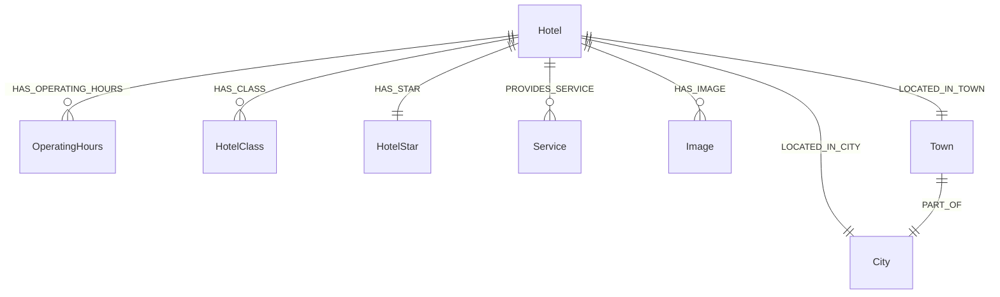

# 觀光資訊資料庫 - 旅宿 (Hotel) Neo4j 圖形資料庫 Schema

此文件定義了台灣觀光旅宿 (飯店、民宿等) 資料匯入至 Neo4j 圖形資料庫時，所採用的標準化欄位與節點關聯格式。
(註：依需求，此版本不包含匯入腳本，僅專注於資料庫結構與串接規範。)

## 1. 系統環境與套件需求 (Dependencies & Models)
- **Neo4j 套件**: `APOC (Awesome Procedures On Cypher)` - 必備，用於進階圖形操作與資料整合。
- **Python 套件**: `sentence-transformers`, `torch`
- **Embedding 模型**: `intfloat/multilingual-e5-large` (1024維) - 負責將旅宿描述 (`description`) 轉為向量，支援 RAG 向量相似度搜尋。

## 2. Neo4j 節點欄位定義 (Node Properties)

以下為旅宿資料庫在 Neo4j 中的節點與欄位詳細說明。

### 主節點：旅宿 `(:Hotel)`
| 欄位名稱 (Property) | 說明 (Description) |
| :--- | :--- |
| `id` | 旅宿唯一識別碼 (PK) |
| `name` | 旅宿名稱 |
| `description` | 旅宿介紹 |
| `lat` | 緯度 |
| `lon` | 經度 |
| `address` | 街道地址 |
| `lowest_price` | 最低房價 |
| `ceiling_price` | 最高房價 |
| `update_time` | 更新時間 |
| `location` | Neo4j 原生空間幾何物件 (Point) |
| `description_embedding` | 介紹文本的向量表示 (1024 維) |

### 關聯節點
營業時間、分類與地理位置在 Neo4j 中會被拆分為獨立節點，並與主節點建立關聯。

| 目標節點 (Target Node) | 欄位名稱 (Property) | 建立之關聯 (Relationship) |
| :--- | :--- | :--- |
| `(:OperatingHours)` | `dayOfWeek`, `openTime`, `closeTime` | `(Hotel)-[:HAS_OPERATING_HOURS]->(OperatingHours)` |
| `(:HotelClass)` | `name` | `(Hotel)-[:HAS_CLASS]->(HotelClass)` |
| `(:HotelStar)` | `star` | `(Hotel)-[:HAS_STAR]->(HotelStar)` |
| `(:City)` | `name` | `(Hotel)-[:LOCATED_IN_CITY]->(City)` |
| `(:Town)` | `name` | `(Hotel)-[:LOCATED_IN_TOWN]->(Town)` |
| `(:Image)` | `id`, `name`, `url`, `description` | `(Hotel)-[:HAS_IMAGE]->(Image)` |
| `(:Service)` | `name` | `(Hotel)-[:PROVIDES_SERVICE]->(Service)` |

## 3. 關聯 (Relationships) 詳細描述

旅宿資料庫具有最豐富的關聯維度，串接人員可利用這些圖形關聯進行高階組合查詢。



### `(Hotel)-[:PROVIDES_SERVICE]->(Service)`
* **說明**: 將旅宿與其擁有的設施(如停車場、健身房、自行車友善)進行綁定。
* **應用場景**: 讓使用者透過勾選過濾器，篩選出具有特定設施的旅宿。
* **Cypher 查詢範例**:
  ```cypher
  MATCH (h:Hotel)-[:PROVIDES_SERVICE]->(s:Service {name: '自行車友善旅宿'})
  RETURN h.name
  ```

### `(Hotel)-[:HAS_CLASS]->(HotelClass)` 與 `(Hotel)-[:HAS_STAR]->(HotelStar)`
* **說明**: 關聯旅宿的分類型態(民宿 vs 觀光旅館)與其星等。
* **應用場景**: 使用使用者指定尋找「五星級」的「國際觀光旅館」。
* **Cypher 查詢範例**:
  ```cypher
  MATCH (h:Hotel)-[:HAS_CLASS]->(:HotelClass {name: '國際觀光旅館'}),
        (h)-[:HAS_STAR]->(:HotelStar {star: 5})
  RETURN h.name, h.lowest_price
  ```

### 地理關聯： `LOCATED_IN_CITY`, `LOCATED_IN_TOWN`, `PART_OF`
* **說明**: 標準化的地理層級知識圖譜，可支援精確行政區查詢。
* **應用場景**: 結合空間距離或行政區查找，例如查詢南投縣魚池鄉的住宿。
  ```cypher
  MATCH (h:Hotel)-[:LOCATED_IN_TOWN]->(t:Town {name: '魚池鄉'})
  RETURN h.name, h.address
  ```

### `(Hotel)-[:HAS_OPERATING_HOURS]->(OperatingHours)`
* **說明**: 關聯每天的服務時段。
* **應用場景**: 便於判斷「現在」或「特定時間」是否開放服務(櫃檯營業時間等)。
  ```cypher
  MATCH (h:Hotel)-[:HAS_OPERATING_HOURS]->(o:OperatingHours {dayOfWeek: 'Monday'})
  RETURN h.name, o.openTime, o.closeTime
  ```

### `(Hotel)-[:HAS_IMAGE]->(Image)`
* **說明**: 連結旅宿相關照片。
* **應用場景**: 在前端呈現旅宿相簿與房型預覽。

## 4. 進階測試指令集 (Advanced Query Examples)

為了方便串接人員測試進階檢索功能，以下提供**空間搜尋** (Spatial Search) 與**語意搜尋** (Semantic Search) 的 Cypher 指令範例：

### 4.1 空間搜尋 (Spatial Search)
旅宿的節點已原生支援 Neo4j 空間幾何物件 (`location`)，可直接進行高效率距離計算。
* **應用場景**: 「尋找距離這附近 5 公里內的住宿選項」。
* **Cypher 查詢範例**:
  ```cypher
  WITH point({latitude: 23.8623, longitude: 120.9340}) AS target_location
  MATCH (h:Hotel)
  WHERE h.location IS NOT NULL
  WITH h, point.distance(target_location, h.location) AS distance
  WHERE distance < 5000 // 單位為公尺
  RETURN h.name, h.lowest_price, distance
  ORDER BY distance ASC
  LIMIT 10
  ```

### 4.2 語意搜尋 (Semantic/Vector Search)
透過 Neo4j 的向量索引 (Vector Index)，比較使用者問句與旅宿介紹 `description_embedding` 相似度。此處會使用建立好的索引 `hotel_description_embedding`。
* **應用場景**: 使用者搜尋「擁有超大落地窗與海景的奢華渡假村」。(需傳入轉換後的問句向量)
* **Cypher 查詢範例**:
  ```cypher
  // $userVector 為使用 intfloat/multilingual-e5-large 模型產生的向量參數
  CALL db.index.vector.queryNodes('hotel_description_embedding', 5, $userVector)
  YIELD node AS h, score
  RETURN h.name, h.description, score
  ORDER BY score DESC
  ```
