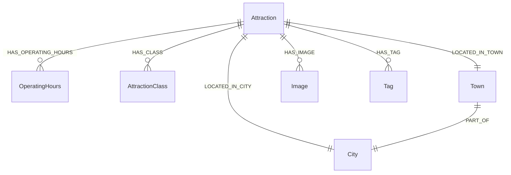

# 觀光資訊資料庫 - 景點 (Attraction) Neo4j 圖形資料庫 Schema

本文件定義了景點資料集針對 **Neo4j 圖形資料庫 (Graph Database)** 的節點 (Nodes) 與關聯 (Relationships) 設計。
(註：依需求，此版本不包含匯入腳本，僅專注於資料庫結構與串接規範。)

## 1. 系統環境與套件需求 (Dependencies & Models)
為了支援圖形資料庫的匯入與向量檢索 (RAG)，系統需要以下套件與模型：
- **Neo4j 套件**: `APOC (Awesome Procedures On Cypher)` - 必備，用於進階的資料處理與關聯建立。
- **Python 套件**: `sentence-transformers`, `torch`
- **Embedding 模型**: `intfloat/multilingual-e5-large` (1024維) - 將景點介紹文本 (Description) 轉換為向量，供 Neo4j Vector Index 進行語意搜尋。

## 2. Neo4j 節點欄位定義 (Node Properties)

以下為景點資料庫在 Neo4j 中的節點與欄位詳細說明。

### 主節點：景點 `(:Attraction)`
| 欄位名稱 (Property) | 說明 (Description) |
| :--- | :--- |
| `id` | 景點唯一識別碼 (Unique, PK) |
| `name` | 景點名稱 |
| `description` | 景點介紹 |
| `lat` | 緯度 |
| `lon` | 經度 |
| `address` | 街道地址 |
| `update_time` | 資料更新時間 |
| `ticket_info` | 票價資訊 |
| `travel_info` | 旅遊建議/交通資訊 |
| `location` | Neo4j 原生空間幾何物件 (Point) |
| `description_embedding` | 景點介紹的 1024 維向量 (供語意搜尋使用) |

### 關聯節點
分類與多值屬性在 Neo4j 中會被拆分為獨立節點，並與主節點建立關聯。

| 目標節點 (Target Node) | 欄位名稱 (Property) | 建立之關聯 (Relationship) |
| :--- | :--- | :--- |
| `(:OperatingHours)` | `dayOfWeek`, `openTime`, `closeTime` | `(Attraction)-[:HAS_OPERATING_HOURS]->(OperatingHours)` |
| `(:AttractionClass)` | `name` | `(Attraction)-[:HAS_CLASS]->(AttractionClass)` |
| `(:City)` | `name` | `(Attraction)-[:LOCATED_IN_CITY]->(City)` |
| `(:Town)` | `name` | `(Attraction)-[:LOCATED_IN_TOWN]->(Town)` |
| `(:Image)` | `id`, `name`, `url`, `description` | `(Attraction)-[:HAS_IMAGE]->(Image)` |
| `(:Tag)` | `name` | `(Attraction)-[:HAS_TAG]->(Tag)` |

## 3. 關聯 (Relationships) 詳細描述

為了讓串接的開發者清楚如何查詢與應用，以下詳細說明節點間的關聯方向與意義。



### `(Attraction)-[:HAS_OPERATING_HOURS]->(OperatingHours)`
* **說明**: 景點的營業時間。將每週營業日與開關門時間作為獨立節點。
* **應用場景**: 查詢特定星期、特定時段有開放的景點。
* **Cypher 查詢範例**:
  ```cypher
  MATCH (a:Attraction)-[:HAS_OPERATING_HOURS]->(o:OperatingHours) 
  WHERE o.dayOfWeek = 'Monday' AND o.openTime <= '14:00:00' AND o.closeTime >= '14:00:00'
  RETURN a.name
  ```

### `(Attraction)-[:HAS_TAG]->(Tag)`
* **說明**: 標示景點所具備的特定屬性或特色標籤。
* **應用場景**: 使用者想尋找具備特定條件的景點。
* **Cypher 查詢範例**:
  ```cypher
  MATCH (a:Attraction)-[:HAS_TAG]->(t:Tag {name: '親子共遊'}) RETURN a.name
  ```

### `(Attraction)-[:HAS_CLASS]->(AttractionClass)`
* **說明**: 景點的官方分類歸屬。
* **應用場景**: 依據大分類 (如國家公園、自然風景區) 篩選景點。
* **Cypher 查詢範例**:
  ```cypher
  MATCH (a:Attraction)-[:HAS_CLASS]->(c:AttractionClass {name: '國家公園'}) RETURN a.name
  ```

### `(Attraction)-[:LOCATED_IN_CITY]->(City)`
* **說明**: 景點所屬的縣市。
* **應用場景**: 查詢特定縣市內的所有景點。
* **Cypher 查詢範例**:
  ```cypher
  MATCH (a:Attraction)-[:LOCATED_IN_CITY]->(c:City {name: '臺北市'}) RETURN a.name
  ```

### `(Attraction)-[:LOCATED_IN_TOWN]->(Town)`
* **說明**: 景點所屬的鄉鎮市區。Town 節點會進一步透過 `PART_OF` 關聯至 City。
* **應用場景**: 查詢特定鄉鎮市區內的景點，或追溯所屬縣市。
* **Cypher 查詢範例**:
  ```cypher
  MATCH (a:Attraction)-[:LOCATED_IN_TOWN]->(t:Town {name: '信義區'}) RETURN a.name
  ```

### `(Attraction)-[:HAS_IMAGE]->(Image)`
* **說明**: 景點關聯的相關圖片。一個景點可以有多張圖片。
* **應用場景**: 在前端介面展示景點的輪播圖。
* **Cypher 查詢範例**:
  ```cypher
  MATCH (a:Attraction {id: 'A1'})-[:HAS_IMAGE]->(i:Image) RETURN i.url, i.name
  ```

## 4. 進階測試指令集 (Advanced Query Examples)

為了方便串接人員測試進階檢索功能，以下提供**空間搜尋** (Spatial Search) 與**語意搜尋** (Semantic Search) 的 Cypher 指令範例：

### 4.1 空間搜尋 (Spatial Search)
透過經緯度計算距離，尋找特定座標 (例如使用者目前所在位置) 附近的景點。
* **應用場景**: 「尋找我附近 5 公里內的景點」。
* **Cypher 查詢範例**:
  ```cypher
  WITH point({latitude: 25.0336, longitude: 121.5650}) AS user_location
  MATCH (a:Attraction)
  WHERE a.location IS NOT NULL
  WITH a, point.distance(user_location, a.location) AS distance
  WHERE distance < 5000 // 單位為公尺
  RETURN a.name, distance
  ORDER BY distance ASC
  LIMIT 10
  ```

### 4.2 語意搜尋 (Semantic/Vector Search)
透過 Neo4j 的向量索引 (Vector Index)，比較使用者輸入的問句向量與景點介紹文本的 `embedding` 相似度。需確保已建立名為 `attraction_description_embedding` 的向量索引。
* **應用場景**: 使用者搜尋「適合帶小孩放電的戶外大自然景點」。
* **Cypher 查詢範例**:
  ```cypher
  // $userVector 為前端透過 LLM Embedding API 產生之 1024 維向量參數
  CALL db.index.vector.queryNodes('attraction_description_embedding', 5, $userVector)
  YIELD node AS a, score
  RETURN a.name, a.description, score
  ORDER BY score DESC
  ```
