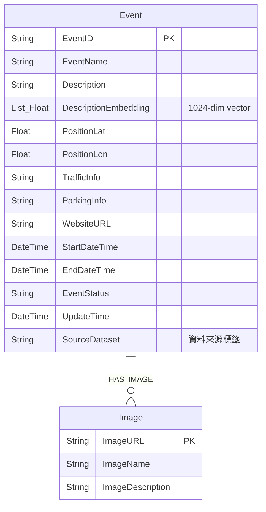

# 活動資料庫 (Neo4j 圖形資料庫) 欄位與結構設計

根據您提供的三個資料集（觀光資訊資料集、競賽活動、親子活動）以及未來使用 Neo4j 圖形資料庫與 RAG 向量搜尋的需求，我為您設計了以下的圖形資料庫結構與欄位映射。

## 1. 圖形模型設計 (Graph Data Model)

在 Neo4j 中，為了妥善處理 `Image` 的多值屬性，並保持實體的正規化，建議將「活動(Event)」與「圖片(Image)」拆分為不同的節點 (Node)，並透過關聯 (Relationship) 連接。



### 節點 1：活動 (Event Node)
這是資料庫的核心節點，儲存活動的主要屬性。
* **EventID** (字串, 唯一鍵): 系統內的唯一識別碼。
* **EventName** (字串): 活動名稱。
* **Description** (字串): 活動詳細介紹，用於提供給 LLM 參考的文本。
* **DescriptionEmbedding** (浮點數陣列, 1024維): 由 `Description` 轉換而來的向量，用於 RAG 向量搜尋。Neo4j 支援 Vector Index 進行高效相似度搜尋。
* **PositionLat** (浮點數): 緯度。
* **PositionLon** (浮點數): 經度。
* **TrafficInfo** (字串): 交通資訊。
* **ParkingInfo** (字串): 停車資訊。
* **WebsiteURL** (字串): 相關網址。
* **StartDateTime** (日期時間): 活動開始時間。
* **EndDateTime** (日期時間): 活動結束時間。
* **EventStatus** (字串): 活動狀態。
* **UpdateTime** (日期時間): 資料最後更新時間。
* **SourceDataset** (字串): 標註資料來源（如：觀光資訊、競賽活動、親子活動），方便後續過濾與管理。

### 節點 2：圖片 (Image Node)
為解決 `ImagesName`、`ImagesURL`、`ImagesDescription` 的多值屬性，獨立為一個節點。
* **ImageURL** (字串, 唯一鍵): 圖片連結。
* **ImageName** (字串): 圖片名稱/標題。
* **ImageDescription** (字串): 圖片描述（若無則留空）。

### 關聯：HAS_IMAGE
* 語法：`(e:Event)-[:HAS_IMAGE]->(i:Image)`
* 說明：一個活動可以關聯到 0 個或多個圖片節點。

---

## 2. 資料集欄位映射表 (Data Mapping)

檢視資料夾中的結構後，這三個資料集的格式分為兩種：
1. **觀光資訊資料集 (`EventList.json`)**：符合交通部觀光局格式。
2. **競賽活動 & 親子活動 (`SearchShowAction.json`)**：符合文化部資料庫格式。

以下是如何將原始資料集的欄位映射到上述的 Neo4j 結構中：

### 活動節點 (Event Node) 映射

| Neo4j 欄位 | 觀光資訊資料集 (`EventList.json`) | 競賽/親子活動 (`SearchShowAction.json`) | 處理建議 |
| :--- | :--- | :--- | :--- |
| **EventID** | `EventID` | `UID` | 確保唯一性，若有重複疑慮可加上前綴。 |
| **EventName** | `EventName` | `title` | |
| **Description** | `Description` | `descriptionFilterHtml` | `SearchShowAction.json` 含有 `\r\n`，建議清洗換行與剩餘 HTML 標籤後再存入，以利後續向量化。 |
| **PositionLat** | `PositionLat` | `showInfo[0].latitude` | 文化部格式可能有多個場次(`showInfo`)，建議取第一筆。為 null 時需設定預設值或略過。 |
| **PositionLon** | `PositionLon` | `showInfo[0].longitude` | 同上。 |
| **TrafficInfo** | `TrafficInfo` | 無對應欄位 | 若無資料可設為空字串 `""` 或 Null。 |
| **ParkingInfo** | `ParkingInfo` | 無對應欄位 | 同上。 |
| **WebsiteURL** | `WebsiteURL` | `sourceWebPromote` 或 `webSales` | 若有多個網址可優先挑選 `sourceWebPromote`。 |
| **StartDateTime**| `StartDateTime` | `showInfo[0].time` (或 `startDate`) | 需統一轉換為 Neo4j Date 格式 (如 `YYYY-MM-DDTHH:mm:ss`)。 |
| **EndDateTime** | `EndDateTime` | `showInfo[0].endTime` (或 `endDate`) | 同上。 |
| **EventStatus** | `EventStatus` | 無對應欄位 | 可依據日期動態判斷，或給予預設值 `Scheduled`。 |
| **UpdateTime** | `UpdateTime` | `editModifyDate` | 統一時間格式。 |
| **DescriptionEmbedding** | (需呼叫 Embedding 模型) | (需呼叫 Embedding 模型) | 讀取清洗後的 `Description` 送入向量模型(1024維)，寫入資料庫。 |

### 圖片節點 (Image Node) 映射

| Neo4j 欄位 | 觀光資訊資料集 (`EventList.json`) | 競賽/親子活動 (`SearchShowAction.json`) |
| :--- | :--- | :--- |
| **ImageURL** | `Images[].URL` | `imageUrl` |
| **ImageName** | `Images[].Name` | 預設為該活動的 `title` 或空字串 |
| **ImageDescription**| `Images[].Description` | 預設為空字串 |

> [!TIP]
> **多值屬性拆解處理方式：**
> - **觀光資訊**：原始資料的 `Images` 是一個陣列，包含多個圖片物件。匯入時需要展開陣列，為每個物件建立對應的 `Image` 節點，然後與該 `Event` 節點建立 `HAS_IMAGE` 關聯。
> - **文化部資料 (競賽/親子)**：原始資料只有一個 `imageUrl` 字串。直接建立一個 `Image` 節點並關聯即可；若 `imageUrl` 為空，則不建立該關聯。

---

## 3. Neo4j 向量搜尋實作建議

為了實作 RAG 向量搜尋，在資料準備完成並匯入後，您需要在 Neo4j 內建立 **Vector Index**。
請確保使用的 Embedding 模型輸出維度為 **1024** (您所要求的維度)，並可執行以下 Cypher 語法來建立索引，讓搜尋效能最佳化：

```cypher
CREATE VECTOR INDEX event_description_index IF NOT EXISTS
FOR (e:Event) ON (e.DescriptionEmbedding)
OPTIONS {indexConfig: {
  `vector.dimensions`: 1024,
  `vector.similarity_function`: 'cosine'
}}
```

日後進行 RAG 查詢時，只要將使用者的問句轉成 1024 維向量，就能透過 `db.index.vector.queryNodes()` 或類似的 Neo4j 函式快速找尋最相近的活動節點。
