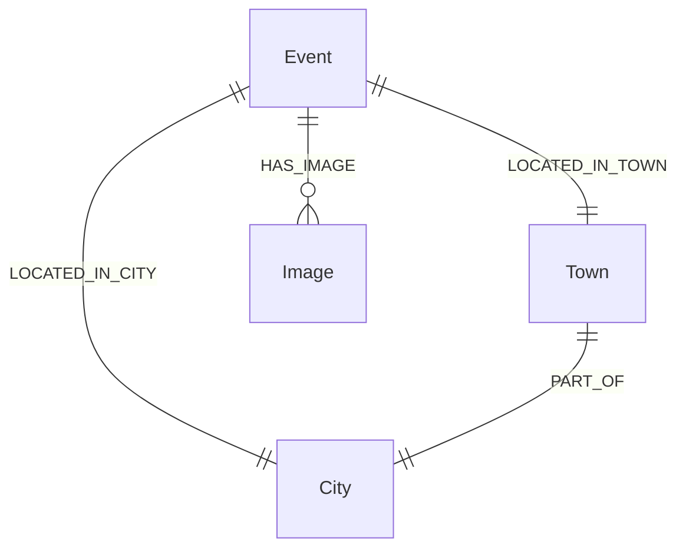

# 觀光資訊資料庫 - 活動 (Event) Neo4j 圖形資料庫 Schema

本文件定義了活動資料集針對 **Neo4j 圖形資料庫** 的節點與關聯設計。
(註：依需求，此版本不包含匯入腳本，僅專注於資料庫結構與串接規範。)

## 1. 系統環境與套件需求 (Dependencies & Models)
為了支援活動文本向量搜尋 (RAG) 以及多值屬性的處理，需要以下套件與模型：
- **Neo4j 套件**: `APOC (Awesome Procedures On Cypher)` - 必備，用於進階圖形演算法與資料解析。
- **Python 套件**: `sentence-transformers`, `torch`
- **Embedding 模型**: `BAAI/bge-m3` 或 `intfloat/multilingual-e5-large` (1024維) - 將活動內容 (`Description`) 轉換為 1024 維向量，供向量索引檢索。

## 2. Neo4j 節點欄位定義 (Node Properties)

以下為活動資料庫在 Neo4j 中的節點與欄位詳細說明。

### 主節點：活動 `(:Event)`
| 欄位名稱 (Property) | 說明 (Description) |
| :--- | :--- |
| `EventID` | 系統內唯一識別碼 (PK) |
| `EventName` | 活動名稱 |
| `Description` | 活動詳細介紹 |
| `PositionLat` | 緯度座標 |
| `PositionLon` | 經度座標 |
| `location` | Neo4j 原生空間幾何物件 (Point) |
| `TrafficInfo` | 交通資訊 |
| `ParkingInfo` | 停車資訊 |
| `WebsiteURL` | 相關網址 |
| `StartDateTime` | 活動開始時間 (DateTime) |
| `EndDateTime` | 活動結束時間 (DateTime) |
| `EventStatus` | 活動狀態 |
| `UpdateTime` | 資料更新時間 (DateTime) |
| `DescriptionEmbedding` | 活動介紹的 1024 維向量表示 |
| `SourceDataset` | 資料來源標記 (固定為 '觀光資訊') |

### 關聯節點
地理位置與圖片在 Neo4j 中會被拆分為獨立節點，並與主節點建立關聯。

| 目標節點 (Target Node) | 欄位名稱 (Property) | 建立之關聯 (Relationship) |
| :--- | :--- | :--- |
| `(:City)` | `name` | `(Event)-[:LOCATED_IN_CITY]->(City)` |
| `(:Town)` | `name` | `(Event)-[:LOCATED_IN_TOWN]->(Town)` |
| `(:Image)` | `ImageURL`, `ImageName`, `ImageDescription` | `(Event)-[:HAS_IMAGE]->(Image)` |

## 3. 關聯 (Relationships) 詳細描述

為了讓串接的開發者清楚如何進行圖形遍歷，以下詳細描述活動資料的節點關聯。



### `(Event)-[:HAS_IMAGE]->(Image)`
* **說明**: 將活動的圖片獨立為節點，解決單一活動有多張圖片的陣列儲存問題。
* **應用場景**: 查詢活動的活動海報或現場照片，用於前端顯示。
* **Cypher 查詢範例**:
  ```cypher
  MATCH (e:Event {EventName: '2026台灣燈會'})-[:HAS_IMAGE]->(i:Image)
  RETURN i.ImageURL
  ```

### 地理關聯： `LOCATED_IN_CITY`, `LOCATED_IN_TOWN`, `PART_OF`
* **說明**: 
  - `(Event)-[:LOCATED_IN_CITY]->(City)`: 標示所屬縣市
  - `(Event)-[:LOCATED_IN_TOWN]->(Town)`: 標示所屬鄉鎮
  - `(Town)-[:PART_OF]->(City)`: 建構台灣行政區地理階層
* **應用場景**: 若開發者需要依據使用者的選擇尋找某行政區內的活動。
* **Cypher 查詢範例** (尋找台北市的活動):
  ```cypher
  MATCH (e:Event)-[:LOCATED_IN_CITY]->(c:City {name: '台北市'}) 
  RETURN e.EventName
  ```

## 4. 進階測試指令集 (Advanced Query Examples)

為了方便串接人員測試進階檢索功能，以下提供**空間搜尋** (Spatial Search) 與**語意搜尋** (Semantic Search) 的 Cypher 指令範例：

### 4.1 空間搜尋 (Spatial Search)
透過經緯度計算距離，尋找特定座標 (例如使用者目前所在位置) 附近的活動。
* **應用場景**: 「尋找我附近 10 公里內近期舉辦的活動」。
* **Cypher 查詢範例**:
  ```cypher
  WITH point({latitude: 25.0336, longitude: 121.5650}) AS user_location
  MATCH (e:Event)
  WHERE e.location IS NOT NULL
  WITH e, point.distance(user_location, e.location) AS distance
  WHERE distance < 10000 // 單位為公尺
  // 可加上時間條件過濾
  // AND e.StartDateTime >= datetime()
  RETURN e.EventName, e.StartDateTime, distance
  ORDER BY distance ASC
  LIMIT 10
  ```

### 4.2 語意搜尋 (Semantic/Vector Search)
透過 Neo4j 的向量索引 (Vector Index)，比較使用者輸入的問句向量與活動內容的 `DescriptionEmbedding` 相似度。需確保已建立名為 `event_description_index` 的向量索引。
* **應用場景**: 使用者搜尋「充滿文青風格的市集與手作體驗」。(需傳入轉換後的問句向量)
* **Cypher 查詢範例**:
  ```cypher
  // $userVector 為使用 BAAI/bge-m3 模型產生的向量參數
  CALL db.index.vector.queryNodes('event_description_index', 5, $userVector)
  YIELD node AS e, score
  RETURN e.EventName, e.Description, score
  ORDER BY score DESC
  ```
