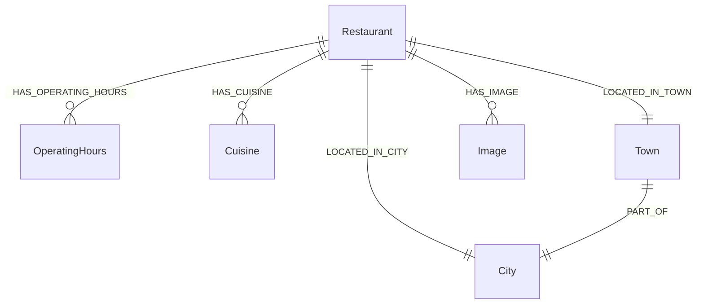

# 觀光資訊資料庫 - 餐飲 (Restaurant) Neo4j 圖形資料庫 Schema

此文件定義了台灣觀光餐飲資料匯入至 Neo4j 圖形資料庫時，所採用的標準化欄位與節點關聯格式。
(註：依需求，此版本不包含匯入腳本，僅專注於資料庫結構與串接規範。)

## 1. 系統環境與套件需求 (Dependencies & Models)
- **Neo4j 套件**: `APOC (Awesome Procedures On Cypher)` - 必備，用於處理複雜的關聯建立與屬性型別轉換。
- **Python 套件**: `sentence-transformers`, `torch`
- **Embedding 模型**: `intfloat/multilingual-e5-large` (1024維) - 負責將餐廳描述文本轉為向量，以支援語意搜尋與 RAG 推薦系統。

## 2. Neo4j 節點欄位定義 (Node Properties)

以下為餐飲資料庫在 Neo4j 中的節點與欄位詳細說明。

### 主節點：餐廳 `(:Restaurant)`
| 欄位名稱 (Property) | 說明 (Description) |
| :--- | :--- |
| `id` | 餐廳唯一識別碼 (PK) |
| `name` | 餐廳名稱 |
| `description` | 餐廳介紹與描述 |
| `lat` | 緯度 |
| `lon` | 經度 |
| `website` | 官方網站網址 |
| `address` | 街道地址 |
| `Description_embedding` | 介紹文本的向量表示 (1024 維) |

### 關聯節點
營業時間、分類與地理位置在 Neo4j 中會被拆分為獨立節點，並與主節點建立關聯。

| 目標節點 (Target Node) | 欄位名稱 (Property) | 建立之關聯 (Relationship) |
| :--- | :--- | :--- |
| `(:OperatingHours)` | `dayOfWeek`, `openTime`, `closeTime` | `(Restaurant)-[:HAS_OPERATING_HOURS]->(OperatingHours)` |
| `(:Cuisine)` | `name` | `(Restaurant)-[:HAS_CUISINE]->(Cuisine)` |
| `(:City)` | `name` | `(Restaurant)-[:LOCATED_IN_CITY]->(City)` |
| `(:Town)` | `name` | `(Restaurant)-[:LOCATED_IN_TOWN]->(Town)` |
| `(:Image)` | `id`, `url`, `name`, `description` | `(Restaurant)-[:HAS_IMAGE]->(Image)` |

## 3. 關聯 (Relationships) 詳細描述

透過圖形資料庫的關聯，可以實作強大的推薦與檢索功能。以下為關聯設計的詳細說明：



### `(Restaurant)-[:HAS_CUISINE]->(Cuisine)`
* **說明**: 將餐廳與其提供的料理類型綁定。一間餐廳可以關聯到多個 Cuisine 節點。
* **應用場景**: 尋找特定料理分類的餐廳推薦，或當使用者搜尋「想吃日式料理」時進行關聯尋找。
* **Cypher 查詢範例**:
  ```cypher
  MATCH (r:Restaurant)-[:HAS_CUISINE]->(c:Cuisine {name: '日式料理'})
  RETURN r.name, r.address
  ```

### 地理關聯： `LOCATED_IN_CITY`, `LOCATED_IN_TOWN`, `PART_OF`
* **說明**: 
  - `(Restaurant)-[:LOCATED_IN_CITY]->(City)`: 標示所屬縣市
  - `(Restaurant)-[:LOCATED_IN_TOWN]->(Town)`: 標示所屬鄉鎮
  - `(Town)-[:PART_OF]->(City)`: 建構台灣行政區地理階層
* **應用場景**: 若開發者需要依據使用者的選擇尋找某行政區內的餐廳，利用此關聯可以輕易達成過濾與範圍搜尋。
* **Cypher 查詢範例** (尋找大安區的餐廳):
  ```cypher
  MATCH (r:Restaurant)-[:LOCATED_IN_TOWN]->(t:Town {name: '大安區'}) 
  RETURN r.name, r.address
  ```

### `(Restaurant)-[:HAS_OPERATING_HOURS]->(OperatingHours)`
* **說明**: 關聯每天的服務時段。
* **應用場景**: 讓前端呈現每週營業時段。

### `(Restaurant)-[:HAS_IMAGE]->(Image)`
* **說明**: 連結餐廳與其相關照片。
* **應用場景**: 在前端卡片元件中提取第一張照片作為餐廳封面。
* **Cypher 查詢範例**:
  ```cypher
  MATCH (r:Restaurant {name: '鼎泰豐'})-[:HAS_IMAGE]->(i:Image)
  RETURN i.url
  ```

## 4. 進階測試指令集 (Advanced Query Examples)

為了方便串接人員測試進階檢索功能，以下提供**空間搜尋** (Spatial Search) 與**語意搜尋** (Semantic Search) 的 Cypher 指令範例：

### 4.1 空間搜尋 (Spatial Search)
透過經緯度計算距離，尋找特定座標 (例如使用者目前所在位置) 附近的餐廳。
* **應用場景**: 「尋找我目前位置 2 公里內的餐廳」。
* **Cypher 查詢範例**:
  ```cypher
  WITH point({latitude: 25.0336, longitude: 121.5650}) AS user_location
  MATCH (r:Restaurant)
  WITH r, point.distance(user_location, point({latitude: r.lat, longitude: r.lon})) AS distance
  WHERE distance < 2000 // 單位為公尺
  RETURN r.name, r.address, distance
  ORDER BY distance ASC
  LIMIT 10
  ```

### 4.2 語意搜尋 (Semantic/Vector Search)
透過 Neo4j 的向量索引 (Vector Index)，比較使用者輸入的問句向量與餐廳介紹的 `Description_embedding` 相似度。需確保已建立對應的向量索引。
* **應用場景**: 使用者搜尋「適合情侶約會且氣氛浪漫的高級餐廳」。(需傳入轉換後的問句向量)
* **Cypher 查詢範例**:
  ```cypher
  // $userVector 為前端透過 LLM Embedding API 產生之向量參數
  CALL db.index.vector.queryNodes('restaurant_description_embedding', 5, $userVector)
  YIELD node AS r, score
  RETURN r.name, r.description, score
  ORDER BY score DESC
  ```
